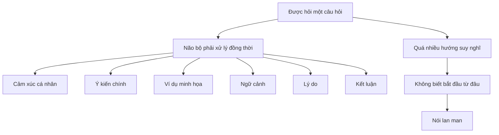

# Mục lục

## [1. Vấn đề cốt lõi](#problem)

## [2. Tại sao chúng ta nói lan man?](#why-rambling)

- [Não bộ quá tải](#brain-overload)
- [Không có framework tư duy](#no-framework)
- [Diagram minh họa](#problem-diagram)

## [3. PREP Framework](#prep-framework)

- [P – Point (Ý chính)](#prep-point)
- [R – Reason (Lý do)](#prep-reason)
- [E – Example (Ví dụ)](#prep-example)
- [P – Point (Nhắc lại)](#prep-point-repeat)
- [Diagram PREP](#prep-diagram)

## [4. Lợi ích của PREP](#benefits)

## [5. So sánh với các framework khác](#comparison)

- [PREP vs STAR](#prep-vs-star)
- [PREP vs SCQA](#prep-vs-scqa)
- [PREP vs Pyramid Principle](#prep-vs-pyramid)

## [6. Ứng dụng thực tế](#practical-application)

- [Trong họp công ty](#meeting)
- [Trong interview](#interview)
- [Trong email/chat](#email-chat)
- [Trong presentation](#presentation)

## [7. Template & Ví dụ](#templates)

## [8. Kết luận](#conclusion)

---

<h1 id="problem">1. Vấn đề cốt lõi</h1>

> **Bạn không chậm, bạn chỉ đang dùng sai công cụ.**

**Hiện tượng phổ biến:**

- Được hỏi ý kiến → trả lời lan man
- Có ý tưởng hay nhưng diễn đạt lủng củng
- Nói nhiều mà không ai hiểu điểm chính

**Nguyên nhân thực sự:**

- KHÔNG phải vì suy nghĩ chậm
- KHÔNG phải vì thiếu kiến thức
- MÀ VÌ **thiếu framework tư duy**

**Thông điệp cốt lõi:**

> Framework giống như **đúng dụng cụ cho đúng công việc**.

---

<h1 id="why-rambling">2. Tại sao chúng ta nói lan man?</h1>

<h2 id="brain-overload">Não bộ quá tải</h2>

**Khi được hỏi một câu hỏi:**

Não bộ phải xử lý đồng thời:

- Cảm xúc cá nhân
- Ý kiến chính
- Ví dụ minh họa
- Ngữ cảnh
- Lý do
- Kết luận

→ **Quá nhiều hướng suy nghĩ** → Không biết bắt đầu từ đâu → Nói lan man

<h2 id="no-framework">Không có framework tư duy</h2>

**Người nói rõ ràng:**

- Có mental models sẵn trong đầu
- Biết cách sắp xếp ý tưởng
- Theo một cấu trúc logic

**Người nói lan man:**

- Không có khung suy nghĩ
- Nghĩ đến đâu nói đến đó
- Tự trách bản thân "mình suy nghĩ chậm"

<h2 id="problem-diagram">Diagram minh họa</h2>



---

<h1 id="prep-framework">3. PREP Framework</h1>

**Giới thiệu:**

- PREP là viết tắt của Point, Reason, Example, Point.
- Là một cấu trúc giúp tổ chức suy nghĩ và trình bày ý tưởng một cách rõ ràng, logic.

<h2 id="prep-point">P – Point (Ý chính)</h2>

- Nêu rõ ý chính ngay từ đầu.
- Tránh vòng vo, dài dòng.

<h2 id="prep-reason">R – Reason (Lý do)</h2>

- Đưa ra lý do, bằng chứng ủng hộ cho ý chính.
- Giải thích tại sao ý chính lại quan trọng.

<h2 id="prep-example">E – Example (Ví dụ)</h2>

- Cung cấp ví dụ minh họa cho ý chính.
- Ví dụ cụ thể, dễ hiểu.

<h2 id="prep-point-repeat">P – Point (Nhắc lại)</h2>

- Nhắc lại ý chính để củng cố.
- Đảm bảo người nghe nhớ rõ thông điệp.

<h2 id="prep-diagram">Diagram PREP</h2>

```
CÂU HỎI ĐƯỢC ĐẶT RA
        |
        v
+----------------------+
| NÃO KHÔNG CÓ FRAMEWORK |
+----------------------+
        |
        v
  Quá nhiều hướng nghĩ
 (cảm xúc / ý kiến /
  ví dụ / ngữ cảnh)
        |
        v
   NÓI LAN MAN
   "blah blah"
        |
        v
  TỰ TRÁCH BẢN THÂN
  "Mình suy nghĩ chậm"
        X
        |
        v
---------------------------------

GIẢI PHÁP

CÂU HỎI
   |
   v
+------------------+
| CHỌN FRAMEWORK   |
|      (PREP)      |
+------------------+
   |
   v
+---------+
| POINT   | → Ý chính
+---------+
     |
     v
+---------+
| REASON  | → Lý do
+---------+
     |
     v
+---------+
| EXAMPLE | → Ví dụ
+---------+
     |
     v
+---------+
| POINT   | → Nhấn mạnh lại
+---------+
     |
     v
GIAO TIẾP RÕ RÀNG
NGẮN GỌN – CÓ MỤC TIÊU

```

<h1 id="benefits">4. Lợi ích của PREP</h1>

- Giúp giao tiếp rõ ràng, súc tích.
- Tăng cường khả năng thuyết phục.
- Dễ dàng truyền đạt ý tưởng phức tạp.
- Tiết kiệm thời gian cho cả người nói và người nghe.

---

<h1 id="comparison">5. So sánh với các framework khác</h1>

<h2 id="prep-vs-star">PREP vs STAR</h2>

- STAR (Situation, Task, Action, Result) thường được sử dụng trong phỏng vấn hành vi.
- PREP tập trung vào việc trình bày ý tưởng một cách logic, thuyết phục hơn.

<h2 id="prep-vs-scqa">PREP vs SCQA</h2>

- SCQA (Situation, Complication, Question, Answer) giúp xác định vấn đề và giải pháp.
- PREP tập trung vào việc trình bày ý tưởng và lập luận.

<h2 id="prep-vs-pyramid">PREP vs Pyramid Principle</h2>

- Cả hai đều giúp tổ chức suy nghĩ và trình bày ý tưởng.
- PREP đơn giản hơn, dễ áp dụng trong nhiều tình huống giao tiếp khác nhau.

---

<h1 id="practical-application">6. Ứng dụng thực tế</h1>

<h2 id="meeting">Trong họp công ty</h2>

- Sử dụng PREP để trình bày ý tưởng, dự án.
- Giúp đồng nghiệp dễ dàng hiểu và đưa ra phản hồi.

<h2 id="interview">Trong interview</h2>

- Trả lời câu hỏi một cách rõ ràng, có cấu trúc.
- Nâng cao khả năng ghi điểm với nhà tuyển dụng.

<h2 id="email-chat">Trong email/chat</h2>

- Trình bày vấn đề, yêu cầu một cách ngắn gọn, rõ ràng.
- Tiết kiệm thời gian cho cả hai bên.

<h2 id="presentation">Trong presentation</h2>

- Sắp xếp nội dung theo cấu trúc PREP.
- Tăng cường tính thuyết phục và dễ hiểu.

---

<h1 id="templates">7. Template & Ví dụ</h1>

**Template PREP:**

```
P - [Ý chính của bạn là gì?]
R - [Lý do tại sao ý chính đó quan trọng]
E - [Ví dụ minh họa cho ý chính]
P - [Nhắc lại ý chính để củng cố]
```

**Ví dụ áp dụng PREP:**

```
P - Chúng ta nên tăng cường giao tiếp trong nhóm.
R - Bởi vì giao tiếp tốt giúp tránh hiểu lầm và tăng cường sự hợp tác.
E - Ví dụ, trong dự án trước, việc không hiểu rõ yêu cầu đã khiến chúng ta mất thêm thời gian sửa chữa.
P - Vì vậy, hãy đảm bảo rằng mọi người đều hiểu rõ nhiệm vụ và trách nhiệm của mình.
```

---

<h1 id="conclusion">8. Kết luận</h1>

**PREP Framework:**

- Là công cụ hữu ích giúp cải thiện kỹ năng giao tiếp.
- Dễ dàng áp dụng trong nhiều tình huống khác nhau.
- Giúp bạn trở thành người giao tiếp tự tin, hiệu quả hơn.

**Hãy bắt đầu áp dụng PREP từ hôm nay để thấy sự khác biệt!**
