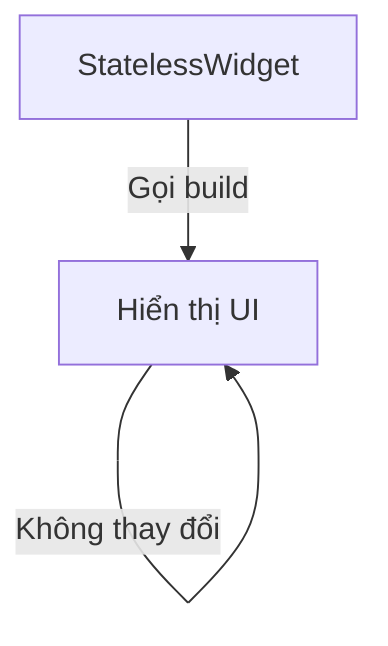
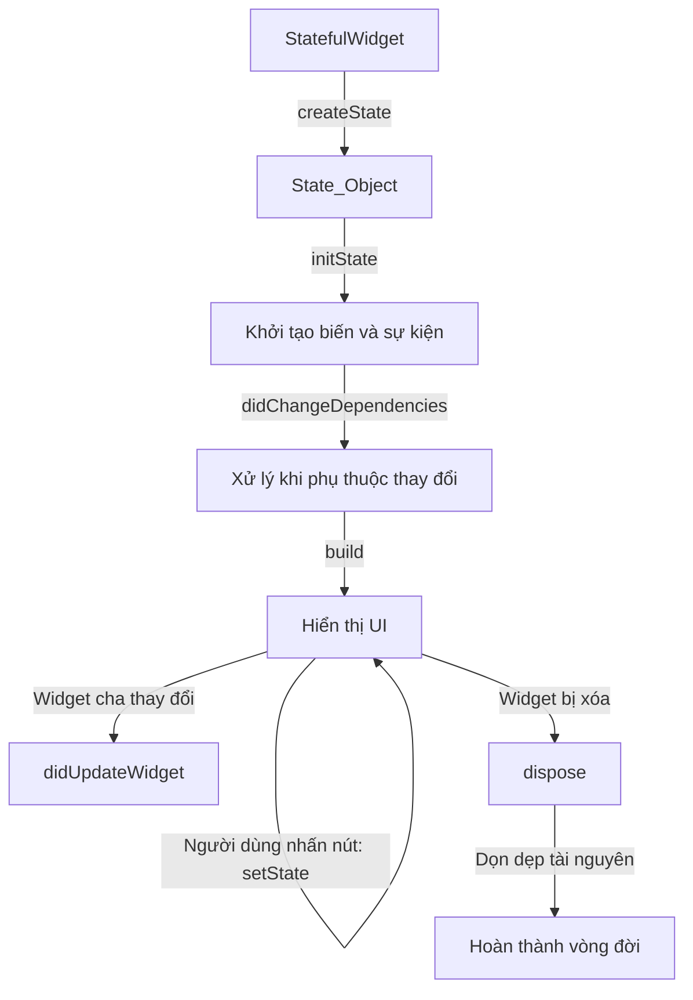
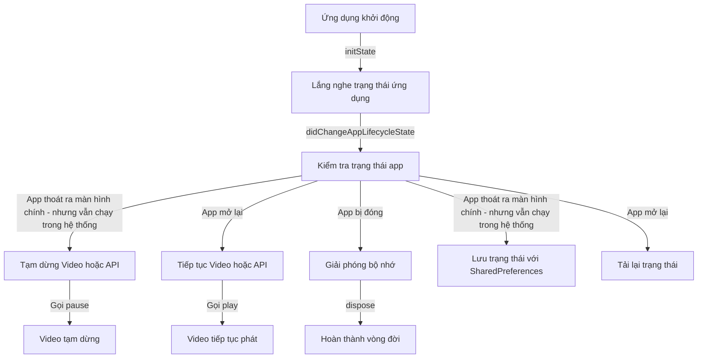

[link bài viết](https://github.com/datnd35-angular/flutter-lifecycle)

# Vòng đời trong Flutter

Vòng đời trong flutter mình có thể phân biệt qua 3 loại vòng đời.

1. **Vòng đời của Widget** trong Flutter? (StatefulWidget, StatelessWidget)
2. **App Lifecycle** (vòng đời của ứng dụng, như khi ứng dụng chạy nền, bị tạm dừng)?
3. **Cách sử dụng lifecycle để quản lý trạng thái ứng dụng?**

## 1. **Vòng đời của Widget** trong Flutter

### **1️⃣ StatelessWidget (Không có trạng thái)**

- Chỉ có phương thức `build()`
- Không thay đổi trạng thái sau khi tạo
- Dùng cho UI cố định



### **2️⃣ StatefulWidget (Có trạng thái)**

- Có thể thay đổi trạng thái
- Gồm 2 phần: **StatefulWidget** (chỉ tạo một lần) và **State** (quản lý trạng thái)
- Gồm 6 giai đoạn chính trong vòng đời



### 🔍 **Hành vi ứng dụng:**

1. **Khi khởi tạo**:  
   `createState()` → `initState()` → `didChangeDependencies()` → `build()`
2. **Khi nhấn nút "Increase Counter"**:  
   Chỉ có `build()` được gọi lại.
3. **Khi widget cha thay đổi**:  
   `didUpdateWidget()` chạy.
4. **Khi đóng ứng dụng**:  
   `dispose()` chạy để giải phóng tài nguyên.

## 2. **App Lifecycle**

```plaintext
+----------------------------+
|        App Lifecycle       |
+----------------------------+
           |
           v
+----------------------------+
|        resumed             | <---------------------------+
|  Ứng dụng đang hiển thị    |                             |
|  Người dùng có thể tương tác|                             |
+----------------------------+                             |
           |                                              |
           v                                              |
+----------------------------+                            |
|        inactive            |                            |
|  Ứng dụng hiển thị nhưng   |                            |
|  không nhận tương tác      |                            |
+----------------------------+                            |
           |                                              |
           v                                              |
+----------------------------+                            |
|        paused              |                            |
|  Ứng dụng bị đẩy vào nền   |                            |
+----------------------------+                            |
           |                                              |
           v                                              |
+----------------------------+                            |
|        detached            |                            |
|  Ứng dụng bị hủy nhưng     |                            |
|  chưa đóng hoàn toàn       |                            |
+----------------------------+                            |
           |                                              |
           +----------------------------------------------+
```

### Mô tả luồng trạng thái:

- Khi ứng dụng đang hoạt động bình thường, nó ở trạng thái **resumed**.
- Nếu người dùng rời ứng dụng (ví dụ: có cuộc gọi đến), ứng dụng chuyển sang **inactive**.
- Nếu ứng dụng bị đẩy vào background (ví dụ: người dùng nhấn nút Home), nó chuyển sang **paused**.
- Nếu ứng dụng bị hủy hoàn toàn (do hệ thống đóng hoặc bị tắt), nó vào trạng thái **detached**.

### Ví dụ

- **inactive** : Ứng dụng hiện thị nhưng không tương tác.
  **Ví dụ:**

  - Khi người user đang dùng ứng dụng nhưng có một cuộc gọi đến và màn hình vẫn hiện thị nhưng ko tương tác được
  - Khi ứng chung cho phép google hay bên thứ 3 thông báo quyền truy cập,...

- **paused** : ảy ra khi ứng dụng bị đẩy vào background nhưng chưa bị đóng hoàn toàn.
  **Ví dụ:**

  - Người dùng nhấn nút Home
  - Chuyển sang ứng dụng khác
  - Màn hình điện thoại tắt (sleep mode)

- **detached** : khi ứng dụng bị hủy nhưng chưa hoàn toàn đóng.
  **Ví dụ:**
  - Khi người dùng vuốt tắt ứng dụng khỏi danh sách ứng dụng đang chạy (Recent Apps trên Android hoặc iOS).
  - Khi điện thoại thiếu RAM, hệ điều hành có thể giết ứng dụng để giải phóng bộ nhớ. Lúc này, ứng dụng sẽ chuyển sang trạng thái detached.

### Cách theo dõi vòng đời ứng dụng

Sử dụng `WidgetsBindingObserver` để lắng nghe thay đổi trạng thái như trong đoạn code mẫu bạn đã cung cấp.

## 3. **Cách sử dụng lifecycle để quản lý trạng thái ứng dụng**



### 🔍 **Giải thích sơ đồ**

1️⃣ **Ứng dụng khởi động** → `initState` chạy, bắt đầu theo dõi trạng thái ứng dụng.  
2️⃣ **Khi trạng thái ứng dụng thay đổi**, `didChangeAppLifecycleState` được gọi.

- Nếu **ứng dụng thoát ra màn hình chính**, video hoặc API bị tạm dừng.
- Nếu **ứng dụng mở lại**, video hoặc API tiếp tục chạy.
- Nếu **ứng dụng bị đóng**, bộ nhớ được giải phóng.  
  3️⃣ **Dừng & tiếp tục phát video**
- Khi ứng dụng thoát ra màn hình chính, `pause` được gọi để dừng video.
- Khi mở lại, `play` được gọi để tiếp tục video.  
  4️⃣ **Lưu & khôi phục trạng thái**
- Khi ứng dụng thoát ra màn hình chính, trạng thái (ví dụ: **counter**) được lưu vào **SharedPreferences**.
- Khi ứng dụng mở lại, trạng thái được tải lại.  
  5️⃣ **Khi ứng dụng bị đóng**, `dispose` được gọi để giải phóng tài nguyên.

# Lưu ý

## 🚀 **Phân biệt "App Lifecycle" và "Cách sử dụng lifecycle để quản lý trạng thái ứng dụng"**

| **Khía cạnh**            | **App Lifecycle**                                             | **Cách sử dụng lifecycle để quản lý trạng thái ứng dụng**                          |
| ------------------------ | ------------------------------------------------------------- | ---------------------------------------------------------------------------------- |
| **Định nghĩa**           | Là các trạng thái mà ứng dụng Flutter trải qua khi hoạt động. | Là cách bạn tận dụng các trạng thái lifecycle để điều khiển luồng xử lý trong app. |
| **Trạng thái liên quan** | `resumed`, `paused`, `inactive`, `detached`                   | Dừng/phát nhạc, lưu trạng thái khi vào nền, tải dữ liệu khi mở lại,...             |
| **Dùng để làm gì?**      | Theo dõi trạng thái ứng dụng trong hệ thống.                  | Áp dụng lifecycle để tối ưu trải nghiệm người dùng và quản lý tài nguyên.          |
| **Công cụ sử dụng**      | `WidgetsBindingObserver`, `didChangeAppLifecycleState()`      | `WidgetsBindingObserver`, `SharedPreferences`, `StreamSubscription`, `Provider`... |
| **Ví dụ cụ thể**         | Ứng dụng vào nền, tạm dừng, bị đóng.                          | Dừng phát nhạc khi vào nền, lưu dữ liệu khi thoát, tải lại UI khi quay lại.        |

## 🛠 **Mối quan hệ giữa chúng**

- **App Lifecycle** là lý thuyết, nó chỉ định nghĩa các trạng thái mà ứng dụng trải qua.
- **Cách sử dụng lifecycle** là cách bạn tận dụng các trạng thái này để xử lý logic phù hợp.

📌 **Ví dụ thực tế:**  
1️⃣ **App Lifecycle (Lý thuyết)**: Khi app vào nền → `paused`  
2️⃣ **Cách sử dụng lifecycle (Ứng dụng thực tế)**: Khi app vào nền → **Dừng video đang phát**

💡 **Tóm lại:** "App Lifecycle" chỉ mô tả các trạng thái của ứng dụng, còn "Cách sử dụng lifecycle" là việc áp dụng các trạng thái đó để quản lý trạng thái và tài nguyên trong ứng dụng. 🚀
