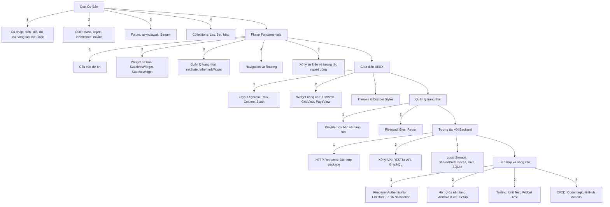

# Roadmap

## 1. **Cơ bản về Dart**

Flutter sử dụng Dart, vì vậy bạn cần hiểu các khái niệm sau:

- Cú pháp cơ bản (biến, kiểu dữ liệu, toán tử, vòng lặp, điều kiện)
- Lập trình hướng đối tượng trong Dart (class, object, inheritance, mixins)
- Future, async/await, Stream
- Collections (List, Set, Map)

## 2. **Flutter Fundamentals**

- Cấu trúc dự án trong Flutter
- Widget cơ bản (StatelessWidget, StatefulWidget)
- Quản lý trạng thái (setState, InheritedWidget)
- Navigation và Routing
- Xử lý sự kiện và tương tác người dùng

## 3. **Giao diện UI/UX**

- Layout system (Row, Column, Stack, Expanded, Flex)
- Widget nâng cao (ListView, GridView, PageView, CustomPaint)
- Themes & Custom Styles

## 4. **Quản lý trạng thái (State Management)**

- Provider (cơ bản và nâng cao)
- Riverpod, Bloc, Redux (nếu cần mô hình phức tạp hơn)

## 5. **Tương tác với Backend**

- HTTP Requests (Dio, http package)
- Xử lý API (RESTful API, GraphQL)
- Local Storage (SharedPreferences, Hive, SQLite)

## 6. **Tích hợp và nâng cao**

- Firebase (Authentication, Firestore, Push Notification)
- Xử lý đa nền tảng (Android & iOS setup)
- Testing (Unit Test, Widget Test)
- CI/CD (Codemagic, GitHub Actions)

# Diagram

